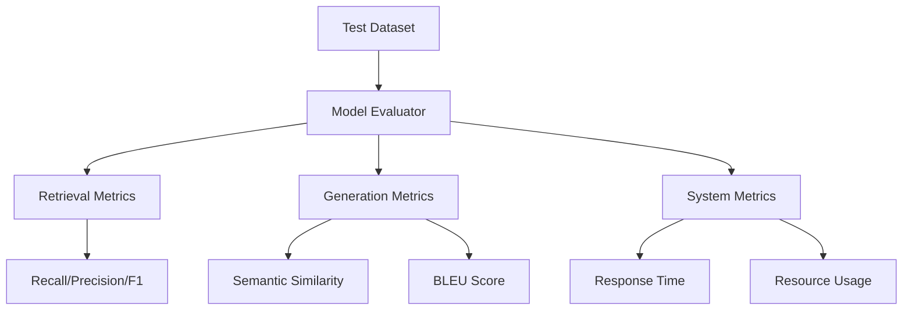

# Paper Reader Agent & Evaluation System

## Overview

This project provides a comprehensive system for processing academic PDFs into a queryable knowledge base and evaluating the performance of the retrieval-augmented generation (RAG) system. The system consists of two main components:

1. **Paper Reader Agent**: Processes PDF documents into a vector database and provides an interface for querying the knowledge base
2. **Evaluation System**: Assesses the performance of the agent across retrieval, generation, and system metrics

## Key Features

- **PDF Processing**: Efficient text extraction and chunking from PDFs
- **Vector Storage**: FAISS-based vector storage with metadata management
- **Natural Language Querying**: Question-answering interface powered by Ollama LLMs
- **Comprehensive Evaluation**: Metrics for retrieval, generation quality, and system performance
- **Modular Design**: Reusable components with clear interfaces
- **Test Dataset Support**: Standardized JSON format for evaluation

## Installation

### Prerequisites
- Python 3.9+
- Ollama server (running locally)

```bash
# Install Ollama (Linux/Mac)
curl -fsSL https://ollama.com/install.sh | sh

# Windows users: Download installer from https://ollama.com/download

# Install embedding model
ollama pull nomic-embed-text

# Install LLM model
ollama pull llama3.2:latest

# Clone repository
git clone https://github.com/StephenHB/paper-reader-agent.git
cd paper-reader-system

# Create virtual environment
python -m venv venv

# Activate environment
source venv/bin/activate  # Linux/Mac
venv\Scripts\activate    # Windows

# Install dependencies
pip install -r requirements.txt

```

## Virtual Environment Setup

### Using Existing Virtual Environment
If you already have a virtual environment set up in the `paper-reader` directory:

```bash
# Activate the existing virtual environment
source paper-reader/bin/activate  # Linux/Mac
# or
paper-reader\Scripts\activate     # Windows

# Verify activation
which python  # Should show path to paper-reader/bin/python
```

### Creating a New Virtual Environment
If you need to create a new virtual environment:

```bash
# Create virtual environment
python -m venv paper-reader

# Activate environment
source paper-reader/bin/activate  # Linux/Mac
paper-reader\Scripts\activate     # Windows

# Install dependencies
pip install -r requirements.txt
```

### Running the Application
After activating the virtual environment, you can run the Streamlit app:

```bash
# Navigate to the code directory
cd code

# Run Streamlit app
streamlit run streamlit_app.py

# The app will be available at:
# Local URL: http://localhost:8501
# Network URL: http://your-ip:8501
```

```

## System Components
```text
+----------------+       +----------------+       +----------------+
|  PDF Documents |       |  Paper Reader  |       |  Vector Store  |
|  (Input)       | ----> |  Agent         | ----> |  (FAISS Index) |
+----------------+       +----------------+       +----------------+
                          |           |
                          |           |    +----------------+
                          |           +--> |  Query Engine  |
                          |                +----------------+
                          |                        |
                          |                        v
                          |                +----------------+
                          +-------------> |  Evaluation     |
                                          |  System         |
                                          +----------------+
```

### 1. Paper Reader Agent
The Paper Reader Agent processes PDF documents and creates a queryable knowledge base.

File Structure
```text
agents/
├── paper_agent.py       # Main agent interface
├── pdf_processor.py     # PDF text extraction and processing
└── vector_store.py      # Vector store management
```
Usage
Build knowledge base:
```bash
python build_agent.py \
    --pdf_dir ./research_papers \
    --index_name physics_papers \
    --interactive
```
Interactive querying:
```bash
# Sample session
👤 Your question: What is the energy distance?
🤖 Assistant (1.24s):
The energy distance is defined as the Euclidean distance between the empirical distributions of d-dimensional independent random variables X and Y.

📚 Sources:
1. Energy_statistics.pdf - Page 1251

👤 Your question: exit
```
### 2. Evaluation System
The evaluation system provides comprehensive assessment of the Paper Reader Agent's performance across three dimensions:
- Retrieval Metrics: Recall, Precision, F1 Score
- Generation Metrics: Semantic Similarity, BLEU Score, Entity Coverage
- System Metrics: Response Time, CPU/Memory Usage

File Structure
```text
evaluation/
├── evaluation_metrics.py  # Core metric calculations
├── evaluator.py           # Evaluation orchestration
└── test_data.test_data.json  # Sample test dataset
```



Run evaluation:
```bash
python evaluate_model.py \
    --test_data evaluation/test_data.test_data.json \
    --index_name physics_papers \
    --vector_store_dir ./vector_stores
```

### Sample Output
```bash
================= Model Evaluation Report =================
Overall Metrics:
- Average Recall: 92.50%
- Average Precision: 85.20%
- Average F1 Score: 88.60%
- Average Semantic Similarity: 0.87
- Average Response Time: 1.24s

Analysis by Difficulty:
Hard Questions:
  - Count: 5
  - Avg F1: 82.30%
  - Avg Semantic Similarity: 0.79

```

## Test Dataset Format
Create test datasets in JSON format:
```bash
# Example test_data.test_data.json
[
  {
    "id": "Q001",
    "question": "What is energy distance?",
    "expected_answer": "The energy distance between...",
    "expected_sources": ["Energy_statistics.pdf"],
    "expected_pages": [1251],
    "difficulty": "medium",
    "category": "Definition"
  }
]
```
## Workflow Automation
Run the full pipeline with a single command:
```bash
#!/bin/bash
# run_pipeline.sh

# Build knowledge base
echo "Building knowledge base..."
python build_agent.py --pdf_dir ./research_papers --index_name physics_papers

# Evaluate model
echo "Evaluating model..."
python evaluate_model.py --test_data evaluation/test_data.test_data.json --index_name physics_papers

echo "Process completed!"
```

```bash
chmod +x run_pipeline.sh
./run_pipeline.sh
```


## Performance Benchmarks
```bash
# Run system benchmark
python evaluation/benchmark.py --index_name physics_papers --num_queries 50
```

### Sample benchmark output:
```text
============== System Performance Benchmark Report ==============
Average Response Time: 1.24s
Minimum Response Time: 0.87s
Maximum Response Time: 2.56s
Average CPU Usage: 18.7%
Average Memory Delta: 45.3 MB
```